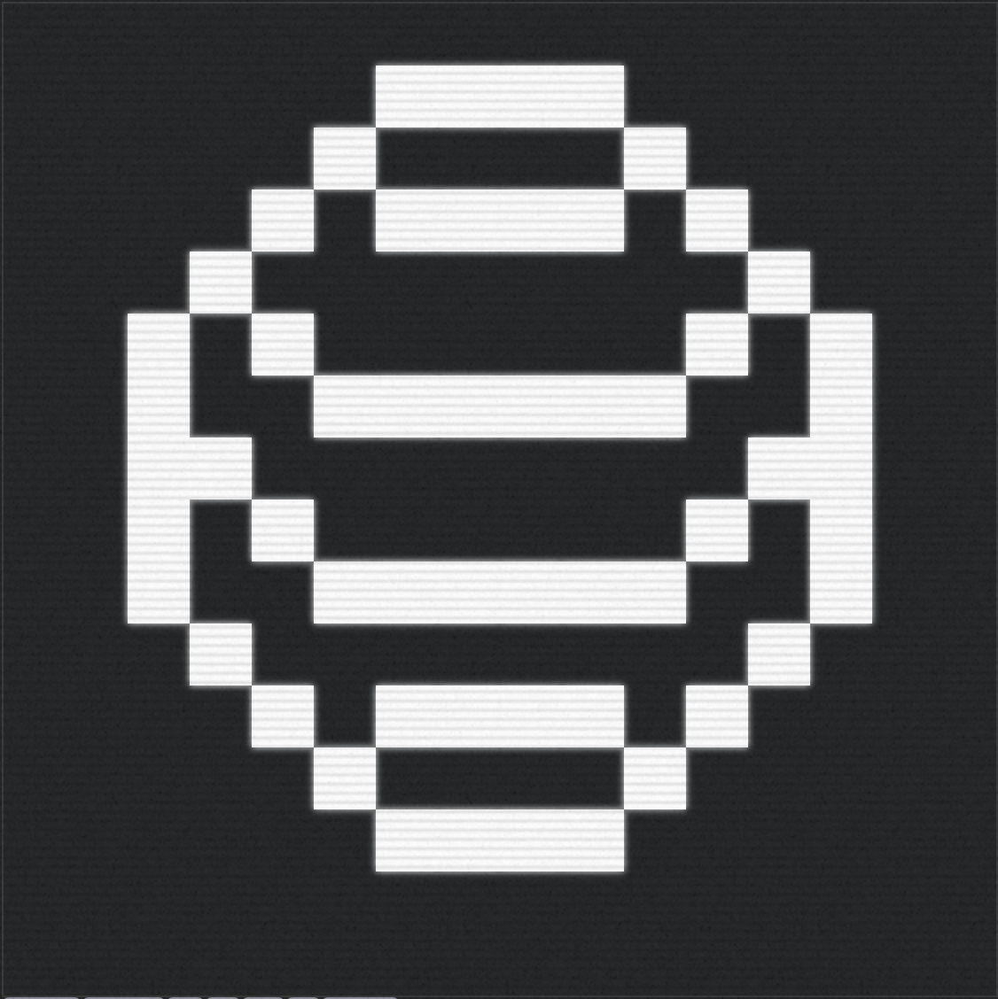

# snowglobe • [](https://github.com/abigger87/snowglobe/actions/workflows/ci.yml)  

A Logistic VRGDA ERC721 Token fractionalizing ownership of [w1nt3r](https://twitter.com/w1nt3r_eth)'s [snow.computer](https://snow.computer) experiment.

## Overview

This is an experimental VRGDA ERC721 for [w1nt3r](https://twitter.com/w1nt3r_eth)'s [snow.computer](https://snow.computer) project. Contracts are **neither** heavily tested nor audited. Use at your own risk.

Currently, [`Globe`](./contracts/Globe.sol) simply wraps ownership of a snow computer `Operator`. In the future, this ownership and it's functionality may be gamified to create a truly unique experiment.

[POLYGON] Globe: [`0x7b20d15334c8A25128aB9D1EDBf7F36e056d63D7`](https://polygonscan.com/address/0x7b20d15334c8A25128aB9D1EDBf7F36e056d63D7)

[POLYGON] Snow Globe V1: [`0xf53d926c13af77c53afae6b33480ddd94b167610`](https://polygonscan.com/address/0xf53d926c13af77c53afae6b33480ddd94b167610)

**Key Features**

✅ VRGDAs
✅ Mint Cost Redemptions (after a week if you still hold the token id, you can redeem the mint price)
✅ No owner, simply ballers
✅ A [w1nt3r](https://twitter.com/w1nt3r_eth) integrated experiment

**Notes**

Deployed to Polygon mainnet with:

```bash
forge script script/Deploy.s.sol:Deploy --rpc-url $RPC_URL --private-key $DEPLOYER_KEY --broadcast --verify --etherscan-api-key $ETHERSCAN_API_KEY --legacy -vvvv
```


## Usage

Install as a dependency using forge.

```bash
forge install abigger87/snowglobe
```

I don't know why you'd do this but you can - alternatively feel free to copy pasta any of this code :) Just be aware these are **not** rigorously tested or audited. Use at your own risk.


## Blueprint

```ml
lib
├─ forge-std — https://github.com/foundry-rs/forge-std
├─ solmate — https://github.com/transmissions11/solmate
├─ vrgdas — https://github.com/transmissions11/vrgdas
scripts
├─ Deploy.s.sol — Simple Deployment Script
src
├─ Globe — The Globe Contract
test
└─ ...
```


## License

[AGPL-3.0-only](https://github.com/abigger87/snowglobe/blob/master/LICENSE)


## Acknowledgements

- [femplate](https://github.com/abigger87/femplate)
- [foundry](https://github.com/foundry-rs/foundry)
- [solmate](https://github.com/Rari-Capital/solmate)
- [forge-std](https://github.com/brockelmore/forge-std)
- [forge-template](https://github.com/foundry-rs/forge-template)
- [foundry-toolchain](https://github.com/foundry-rs/foundry-toolchain)


## Disclaimer

_These smart contracts are being provided as is. No guarantee, representation or warranty is being made, express or implied, as to the safety or correctness of the user interface or the smart contracts. They have not been audited and as such there can be no assurance they will work as intended, and users may experience delays, failures, errors, omissions, loss of transmitted information or loss of funds. The creators are not liable for any of the foregoing. Users should proceed with caution and use at their own risk._
